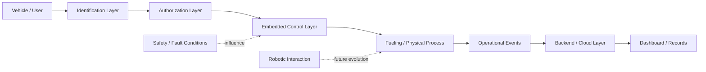

<div align="center">

# Smart / Robotic Fueling System

### Embedded Systems · Automation · IoT · Cloud · Robotics

A portfolio case study for a connected fueling concept that combines vehicle identification, embedded control, operational data, cloud services, and a future path toward robotic physical interaction.


</div>

---

## Why this project exists

Fueling is a physical process, but many of the problems around it are digital: **identification, authorization, traceability, operational visibility, and coordination between devices and software**.

This project explores a system in which a vehicle or user can be identified, an authorized fueling workflow can be triggered, operational events can be recorded, and software/cloud services can provide visibility around the process.

The project originally involved hands-on prototype work around **RFID identification, embedded control, sensors, application/backend concepts, and fueling automation**. The original implementation artifacts are no longer available, so this repository does **not** pretend to contain the historic source code, wiring, or prototype proof.

Instead, this repository documents the engineering concept accurately as a **public case study** and separates known project direction from future concepts.

---

## System concept



The engineering value is in the **integration between physical systems and digital infrastructure** rather than in any single component.

---

## Engineering layers

| Layer | Responsibility |
|---|---|
| **Identification** | Recognize a vehicle or user through a suitable identity mechanism such as RFID |
| **Authorization** | Decide whether the requested fueling action is permitted |
| **Embedded control** | Read inputs, coordinate device actions, and manage the local process |
| **Physical process** | Interact with the fueling hardware and related sensors/actuators |
| **Backend / cloud** | Receive operational events, store records, and support connected services |
| **Dashboard** | Present system state, transaction history, alerts, and operational information |
| **Robotics** | Future direction for reducing manual physical interaction |

---

## Simplified operating flow

```text
1. Vehicle / user arrives
2. Identity is presented
3. Authorization is checked
4. Embedded system coordinates the permitted process
5. Operational events are generated
6. Backend / cloud records relevant information
7. Dashboard provides visibility
8. Faults or unsafe conditions should interrupt the process
```

Detailed state transitions, sensor thresholds, wiring, control timing, and fail-safe logic are intentionally not published.

---

## What is historical vs. conceptual

| Area | Public status |
|---|---|
| RFID-based identification concept | Part of the original project direction |
| Embedded controller / sensor integration | Part of the original project direction |
| Connected application/backend idea | Part of the original project direction |
| Transaction / event visibility | Part of the system concept |
| Full production fueling hardware | Not claimed in this repository |
| Production-grade autonomous robotic fueling | Future direction / concept |
| Historic source code, wiring, and prototype media | Not available |

This distinction is intentional. The repository is designed to show **systems thinking without inventing evidence**.

---

## Design priorities

### Safety before automation

Automation around a physical fueling process must treat unsafe conditions, manual intervention, and fault handling as first-class concerns. This repository therefore discusses safety only at a high level and does not publish operational control parameters.

### Traceability

A connected system should make important events visible: identification, authorization outcome, process start/stop, faults, and transaction records.

### Separation of responsibilities

The design separates identity, authorization, device control, operational data, backend services, and user-facing visibility so that each layer can evolve independently.

### Least exposure

A public portfolio should show architecture and reasoning without exposing implementation details that could be unsafe, commercially sensitive, or misleading.

---

## Repository map

```text
smart-robotic-fueling-system/
├── README.md
├── docs/
│   ├── system-overview.md
│   ├── workflow.md
│   ├── security-and-safety.md
│   ├── architecture-decisions.md
│   └── roadmap.md
├── hardware/
├── firmware/
├── backend/
├── dashboard/
└── assets/
```

### Documentation

- [`docs/system-overview.md`](docs/system-overview.md) — system boundaries and architecture
- [`docs/workflow.md`](docs/workflow.md) — operating flow and failure-aware sequence
- [`docs/security-and-safety.md`](docs/security-and-safety.md) — security and safety design principles
- [`docs/architecture-decisions.md`](docs/architecture-decisions.md) — major engineering decisions and trade-offs
- [`docs/roadmap.md`](docs/roadmap.md) — realistic implementation path from case study to demonstrable prototype

---

## Public repository boundary

This repository deliberately does **not** publish:

- exact wiring diagrams
- component-level control logic
- fueling control parameters
- detailed sensor thresholds
- security credentials or secrets
- production backend internals
- unsafe or unverified automation instructions

The goal is to demonstrate engineering reasoning, not provide a blueprint for a real fuel-handling system.

---

## Portfolio value

This project demonstrates how I approach a problem that crosses multiple engineering domains:

`Embedded Systems` · `RFID` · `Sensors` · `Automation` · `IoT` · `Backend` · `Cloud` · `Operational Data` · `Robotics`

It is also an example of **systems integration thinking**: connecting identity, software, devices, networks, data, and physical processes into one architecture.

---

## Current status

**Public case study: complete**

The historic prototype is not being represented as a currently reproducible build. Future work, if resumed, would start with a new safe prototype and publish only verified, non-sensitive evidence.

---

<div align="center">

### Physical Systems × Software × Automation × Cloud

<sub>Engineering case study — implementation details intentionally limited.</sub>

</div>
