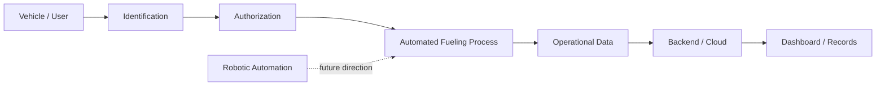

<div align="center">

# Smart / Robotic Fueling System

### Automation · Embedded Systems · Cloud Integration

A systems-engineering project exploring how fueling operations can be made more automated, traceable, and connected through software, embedded control, and cloud services.


</div>

---

## Project overview

This project combines **embedded systems, automation, software, and cloud/backend concepts** around a smarter fueling workflow.

The goal is to reduce manual steps, improve traceability, and explore how connected systems can support safer and more efficient fueling operations.

The project includes work across areas such as:

- identification and access control
- embedded control and sensing
- automation logic
- backend / cloud integration
- transaction and event visibility
- future robotic interaction concepts

> This public repository is intentionally high-level. Detailed control logic, hardware implementation, wiring, backend design, and other sensitive implementation details are not published here.

---

## High-level concept



The focus of the project is the integration between **physical systems and digital infrastructure**, rather than any single component.

---

## Engineering areas

| Area | Focus |
|---|---|
| **Embedded Systems** | Device-level control, sensing, and interaction with the physical process |
| **Automation** | Coordinating system actions and reducing manual intervention |
| **Cloud / Backend** | Supporting connected data, records, and system visibility |
| **IoT** | Connecting physical hardware with software and networked services |
| **Robotics** | Exploring future automation of physical fueling interactions |

---

## Project status

This repository is maintained as a **portfolio case study** for the project.

Public content will focus on:

- project purpose
- high-level architecture
- selected prototype media
- technology areas
- engineering lessons
- project evolution

Detailed implementation information will remain private.

---

## Repository structure

```text
smart-robotic-fueling-system/
├── README.md
├── docs/
├── hardware/
├── firmware/
├── backend/
├── dashboard/
└── assets/
```

As the project develops, these sections will contain selected public material without exposing sensitive implementation details.

---

## Public roadmap

- [x] Define the project concept and scope
- [x] Create a public engineering case-study repository
- [ ] Add selected prototype photos
- [ ] Add selected system screenshots
- [ ] Add a simplified architecture visual
- [ ] Add a project demo / video
- [ ] Document key engineering lessons
- [ ] Publish selected non-sensitive technical material

---

## Technology areas

`Embedded Systems` · `IoT` · `Automation` · `Cloud` · `Backend` · `RFID` · `Sensors` · `Robotics`

---

<div align="center">

### Physical Systems × Software × Automation × Cloud

<sub>Public case study — implementation details intentionally limited.</sub>

</div>
