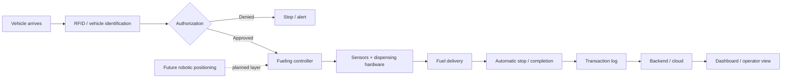

<div align="center">

# Smart / Robotic Fueling System

### RFID · Embedded Control · Automation · Cloud / Backend

A systems-engineering project exploring how vehicle identification, authorization, embedded control, sensing, transaction logging, and robotic fueling can be combined into one automated fueling workflow.


</div>

---

## Why this project exists

Fueling is normally treated as a manual interaction between a driver, a pump, and a payment or authorization system. This project explores a different model: **the vehicle is identified, authorized, fueled, and logged through one coordinated system**.

The engineering challenge is not only software. The system has to connect multiple layers reliably:

- vehicle identification
- authorization logic
- embedded control
- sensors and fueling hardware
- backend / cloud services
- transaction records
- operator visibility
- future robotic positioning and fueling automation

That combination is what makes this project interesting to me.

---

## System concept



> **Important:** the repository separates implemented/prototyped work from planned future capabilities. Robotic positioning and fully autonomous nozzle handling are part of the project direction and should not be read as completed functionality unless documented as such in this repository.

---

## Engineering layers

| Layer | Role in the system |
|---|---|
| **Identification** | Recognize the vehicle/user using RFID-based identification |
| **Authorization** | Decide whether fueling is permitted before enabling dispensing |
| **Embedded control** | Coordinate sensors, actuators, safety conditions, and fueling logic |
| **Fueling hardware** | Interface with pump/flow/actuation concepts and physical dispensing |
| **Backend / cloud** | Store system events and transaction information |
| **Dashboard** | Present operational and transaction information |
| **Robotics** | Planned automation layer for positioning and autonomous fueling |

---

## Intended workflow

```text
01  Vehicle arrives
       ↓
02  System identifies vehicle / user
       ↓
03  Authorization is checked
       ↓
04  Fueling controller enables the process
       ↓
05  Sensors monitor the fueling operation
       ↓
06  System stops dispensing when the operation completes
       ↓
07  Transaction / event data is recorded
       ↓
08  Backend and dashboard receive the result
       ↓
09  Future layer: robotic positioning + autonomous nozzle handling
```

A more detailed workflow is available in [`docs/workflow.md`](docs/workflow.md).

---

## Repository structure

```text
smart-robotic-fueling-system/
├── README.md
├── docs/
│   ├── system-overview.md
│   └── workflow.md
├── hardware/
│   └── README.md
├── firmware/
│   └── README.md
├── backend/
│   └── README.md
├── dashboard/
│   └── README.md
└── assets/
    └── README.md
```

The folders are intentionally separated by engineering layer so the repository can grow without mixing hardware, firmware, backend, and documentation into one place.

---

## Current repository status

This repository is being built as a **technical record of the project**, not as a marketing-only concept page.

At this stage it contains:

- system architecture and scope
- workflow documentation
- separation between implemented/prototyped work and future development
- dedicated areas for hardware, firmware, backend, dashboard, and project media

Actual source code, wiring details, photos, videos, and hardware specifications will be added only where they reflect the real project work.

---

## Roadmap

### Phase 1 — System documentation
- [x] Define repository structure
- [x] Document high-level architecture
- [x] Document operating workflow
- [ ] Add real prototype photos / media
- [ ] Add verified hardware list
- [ ] Add wiring / interface documentation

### Phase 2 — Prototype documentation
- [ ] Add firmware used in the prototype
- [ ] Document RFID identification flow
- [ ] Document sensor and actuator behavior
- [ ] Add backend / transaction flow documentation
- [ ] Add dashboard screenshots where available

### Phase 3 — Production-style engineering
- [ ] Define failure states and recovery behavior
- [ ] Add monitoring / logging design
- [ ] Add security and authorization model
- [ ] Document deployment architecture
- [ ] Add testing strategy

### Phase 4 — Robotic fueling direction
- [ ] Positioning / alignment design
- [ ] Robotic actuation concept
- [ ] Safety interlocks
- [ ] Automated nozzle handling
- [ ] Full end-to-end autonomous workflow

---

## Design principles

**Safety before automation**  
Any automated fueling system has to fail safely. Authorization, sensing, physical interlocks, and emergency stop behavior matter more than convenience.

**Separate control from presentation**  
The embedded controller should not depend on the dashboard to operate safely.

**Trace every operation**  
Identification, authorization, fueling state, completion, and errors should produce clear records.

**Do not hide project maturity**  
Prototype work, documented design, and future concepts are labeled separately throughout this repository.

---

## Documentation

- [`System Overview`](docs/system-overview.md)
- [`Operating Workflow`](docs/workflow.md)
- [`Hardware`](hardware/README.md)
- [`Firmware`](firmware/README.md)
- [`Backend`](backend/README.md)
- [`Dashboard`](dashboard/README.md)

---

<div align="center">

### Vehicle → Identity → Authorization → Control → Fueling → Data

<sub>One system across software, infrastructure, and the physical world.</sub>

</div>
