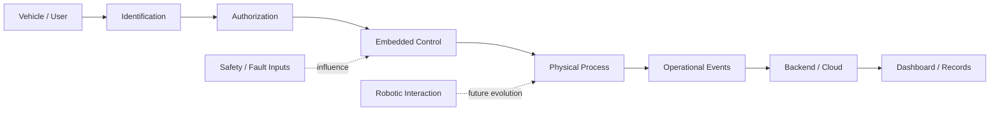

# System Overview

## Purpose

The Smart / Robotic Fueling System is a systems-engineering case study combining **identification, authorization, embedded control, automation, IoT, backend/cloud services, and future robotic interaction** around a connected fueling workflow.

This public document intentionally remains high-level. It explains architecture and system boundaries without publishing detailed control logic, wiring, operational parameters, or sensitive backend implementation.

---

## System boundary

The system is viewed as several cooperating layers rather than one monolithic application:

---

## Layer responsibilities

### Identification

Recognizes the vehicle or user through an identity mechanism such as RFID.

### Authorization

Determines whether the requested operation is allowed. Identity and authorization are deliberately separated.

### Embedded control

Coordinates local device behavior, reads inputs, and interacts with the physical process.

### Physical process

Represents the real-world fueling interaction and associated sensing/actuation.

### Operational events

Captures important state changes such as identity presentation, authorization outcome, process activity, faults, and completion.

### Backend / cloud

Supports event storage, integration, records, and connected operational visibility.

### Dashboard / records

Presents system state, historical events, alerts, and operator-facing information.

### Robotics

Represents a future extension for automating physical interaction. It is not claimed as a completed production system in this repository.

---

## Core design idea

The main engineering challenge is not any single sensor, controller, cloud service, or application. It is the **coordination between physical and digital layers**.

The architecture therefore emphasizes:

- explicit trust and responsibility boundaries
- local control near the physical process
- separation between identity and permission
- traceable operational events
- cloud/backend visibility without making the cloud the only control path
- safe interruption when faults or unknown states occur

---

## Historical project context

The original project direction included RFID-based identification, embedded hardware, sensors, application/backend concepts, and automation around fueling.

The original code, wiring, photos, and build artifacts are no longer available. This repository therefore documents the engineering concept as a case study instead of recreating evidence that does not exist.

---

## Public documentation policy

This repository is intended as a **portfolio case study**, not a production implementation guide.

The following are intentionally excluded from the public documentation:

- detailed wiring and component-level control interfaces
- fueling control parameters and timing
- exact sensor thresholds
- fail-safe implementation details
- credentials, secrets, or production identifiers
- production backend internals

The repository focuses on architecture, system thinking, safety/security principles, and project evolution.
