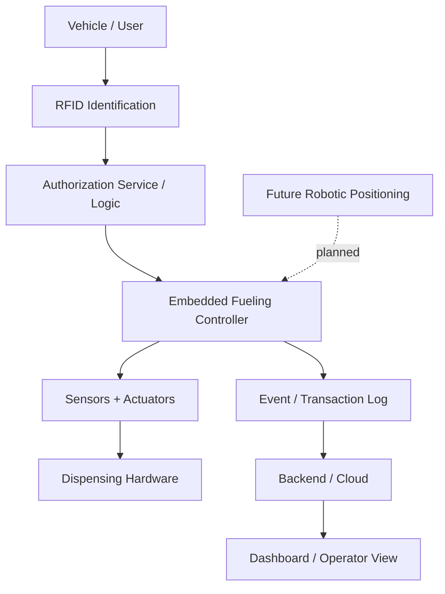

# System Overview

## Purpose

The Smart / Robotic Fueling System explores an automated fueling workflow that connects **vehicle identification, authorization, embedded control, sensing, transaction logging, backend services, and future robotic actuation**.

The project is intentionally documented by system layer so completed work, prototype work, and future concepts remain distinguishable.

## High-level architecture

## Responsibilities by layer

### Identification
Provides a machine-readable identity for the vehicle or user. The current project direction uses RFID as the primary identification concept.

### Authorization
Determines whether the requested fueling action is allowed before the system enables physical dispensing.

### Embedded control
Coordinates the real-time physical process. This layer should be responsible for safe state transitions, sensor readings, actuation, stop conditions, and error handling.

### Backend / cloud
Receives and stores events or transaction information from the system and supports higher-level operational visibility.

### Dashboard
Provides a human-readable view of system state, records, and future operational information.

### Robotics
A future project layer intended to automate positioning and nozzle handling. It is not treated as completed functionality unless corresponding implementation evidence is added to this repository.

## Engineering priorities

1. **Safety** — physical control must fail safely.
2. **Authorization** — dispensing must not begin without a valid authorization state.
3. **Separation of concerns** — embedded control, backend, and UI should have clearly defined responsibilities.
4. **Observability** — state transitions and failures should be recorded.
5. **Traceability** — documentation should clearly show what is implemented versus planned.
