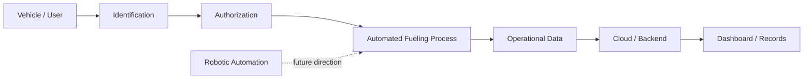

# System Overview

## Purpose

The Smart / Robotic Fueling System is an engineering project combining **automation, embedded systems, IoT, and cloud/backend integration** around a connected fueling workflow.

This public document intentionally stays at a high level. It explains the project direction without publishing detailed implementation logic, hardware design, wiring, security controls, or backend architecture.

## High-level architecture

## Main engineering areas

- **Identification & access** — recognizing an authorized vehicle or user.
- **Embedded systems** — interacting with sensors and the physical process.
- **Automation** — coordinating the fueling workflow.
- **Cloud / backend** — supporting records, connectivity, and operational visibility.
- **Robotics** — future exploration of additional physical automation.

## Public documentation policy

This repository is intended as a **portfolio case study**, not a full implementation blueprint. Detailed system design, control logic, hardware interfaces, source code, and other sensitive technical material are kept private.
