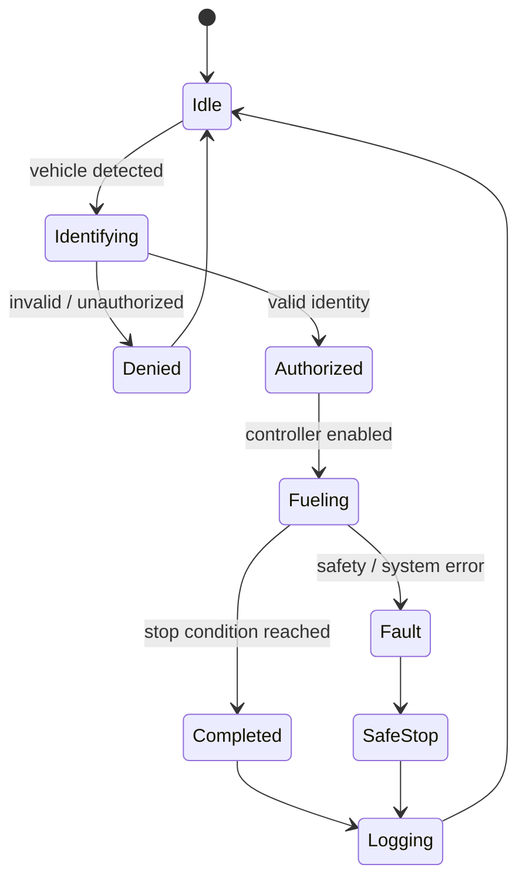

# Operating Workflow

This document describes the intended end-to-end fueling sequence at a system level.

## Sequence

### 1. Vehicle arrival
The vehicle enters the fueling position and the system becomes ready to identify it.

### 2. Identification
An RFID identifier is read and associated with the vehicle or authorized user.

### 3. Authorization
The system checks whether fueling is permitted. If authorization fails, the process stops before physical dispensing begins.

### 4. Controller enable
After approval, the embedded controller transitions the system into an enabled fueling state.

### 5. Physical fueling
Sensors and actuators participate in the fueling process while the controller tracks the operation and watches for stop or fault conditions.

### 6. Completion / stop
Fueling ends when the defined completion condition is reached or when the system enters a stop or fault state.

### 7. Logging
The system records the result of the operation, including the relevant identity, authorization result, fueling event, and completion/error state where available.

### 8. Backend synchronization
Transaction or operational data is sent to the backend/cloud layer for storage and later retrieval.

### 9. Dashboard visibility
The dashboard presents relevant records and system information to an operator or administrator.

## Planned autonomous extension

A future robotics layer can add:

1. vehicle/fuel-port positioning
2. robotic arm alignment
3. nozzle engagement
4. automated dispensing
5. nozzle disengagement
6. safe return to home position

These steps represent the intended project direction and are not claimed as completed unless implementation evidence is added to the repository.

## State model

